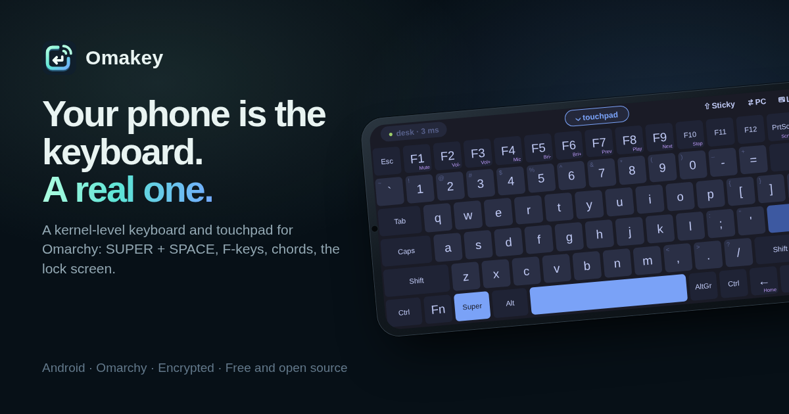

# Omakey for Omarchy

**Your phone becomes a real keyboard for your Omarchy desktop.**

<p align="center">
  <a href="https://gladimdim.github.io/omakey-omarchy-plugin/"></a>
</p>

- **Website and live demo:** <https://gladimdim.github.io/omakey-omarchy-plugin/>
- **Android app:** [download the latest APK](https://github.com/gladimdim/omakey-mobile/releases/latest)
  ([source](https://github.com/gladimdim/omakey-mobile)), or scan this with your phone:

<p>
  <a href="https://github.com/gladimdim/omakey-mobile/releases/latest"></a>
</p>

Pair the Omakey phone app with a QR code and the desktop gets a new
keyboard: Esc, F1–F12, Super, Ctrl, Alt, arrows, media keys, all of it.
Hold `SUPER + SPACE`, `CTRL + SHIFT + T` or any chord with as many fingers
as you like, just as on a USB keyboard, but over Wi-Fi.

- **A real keyboard, not a text box.** `omakeyd` creates a kernel virtual
  keyboard (`uinput`). Hyprland binds, games, terminals and the lock screen
  all see key presses, and your keyboard layout (US, Ukrainian, …) applies.
- **Fast.** One UDP packet per key, sent the moment your finger lands.
  Typically a few milliseconds on home Wi-Fi.
- **No stuck keys.** Every packet carries every held key, so lost packets
  heal themselves, and if the phone goes quiet for half a second its keys are
  released.
- **Private.** The QR code holds a 256-bit key; every packet is encrypted
  and authenticated (AES-256-GCM), with replay protection. Nobody else on
  the Wi-Fi can type on your machine.
- **Touchpad too.** Pull the touchpad down in the app to move the mouse,
  click, right-click and scroll. It is a second virtual device, "Omakey
  Mouse", next to "Omakey Keyboard".
- **Bar widget.** See which phones are connected, pair new ones, and forget
  old ones.
- **Lock lights.** Caps Lock, Num Lock and Scroll Lock state goes back to
  the phone, so the app can show it.
- **Shared clipboard.** Copy on the phone copies what's selected on the
  desktop and puts it on the phone's clipboard too; Paste pastes on the
  desktop, bringing the phone's clipboard along when it has something newer.
  Needs `wl-copy` and `wl-paste` (Omarchy has them), or KDE's clipboard.

## Install

Needs Omarchy 4 with the Omarchy shell (`omarchy plugin` available) and an
Android phone on the same Wi-Fi.

**1. On the desktop**, one command:

```bash
omarchy plugin add https://github.com/gladimdim/omakey-omarchy-plugin --enable && ~/.config/omarchy/plugins/gladimdim.omakey/install.sh
```

It adds the bar widget, then builds and starts `omakeyd`. It asks for your
password once, and installs Rust first if it's missing.

Added the plugin some other way, such as from the
[Omarchy plugin marketplace](https://omarchyplugins.com/)? Click the ⌨ icon
in the bar and choose *Set up Omakey*. It runs the same `install.sh`.

**2. On the phone**, install the
[latest Omakey APK](https://github.com/gladimdim/omakey-mobile/releases/latest)
(scan the QR code above). Allow *Install unknown apps* for your browser
when Android asks.

**3. Pair:** click the ⌨ icon in the bar, *Pair a phone*, and scan the code
with the Omakey app.

### What `install.sh` installs

| What | Why |
|------|-----|
| `/usr/local/bin/omakeyd` | the service and its CLI |
| `/etc/udev/rules.d/70-omakey-uinput.rules` | lets *you* (not root) create the virtual keyboard |
| `/etc/modules-load.d/omakey.conf` | loads `uinput` at boot |
| `~/.config/systemd/user/omakeyd.service` | runs it in your session |
| ufw: UDP 47800 and 5353 from private networks | only if ufw is active (10/8, 172.16/12, 192.168/16, and 100.64/10 for Tailscale) |

If the service doesn't start right after installing, log out and back in
once so the udev rule applies to your session.

### Steam Deck with SteamOS

`omakeyd` runs on a stock Steam Deck too, no Omarchy needed, in Game Mode
and Desktop Mode. In Desktop Mode, open Konsole and run:

```bash
curl -fsSL https://raw.githubusercontent.com/gladimdim/omakey-omarchy-plugin/main/install-steamos.sh | bash
```

It needs no sudo and no compiler: it downloads the static `omakeyd` from the
latest release, checks its checksum, and puts everything in your home
folder, where SteamOS updates leave it alone (`~/.local/bin/omakeyd` and a
user service). Steam's own controller rule already lets you create the
virtual keyboard; if a Deck lacks it, the installer prints the one root
command to add it. To pair, open **Omakey: pair a phone** from the app menu
or, after the installer adds it, from Steam's Non-Steam library in Game
Mode: it shows the QR code in Konsole. `omakeyd pair`, `status`, `devices`
and `forget` work there as on Omarchy (`~/.local/bin/omakeyd`).

What differs from Omarchy: there's no bar widget, the phone doesn't follow a
desktop theme, and the phone's keyboard layout doesn't switch the Deck's.
The shared clipboard works in Desktop Mode (through KDE's clipboard); in
Game Mode Copy and Paste press the keys. Remove it with
`... install-steamos.sh | bash -s -- --uninstall`.

## The bar widget

Click the ⌨ icon in the bar. The panel does everything:

- **Set up** — first time, *Set up Omakey* runs `install.sh` in a terminal
  (it asks for your password there). *Update the service* appears when the
  installed `omakeyd` is older than the widget.
- **Pair** — *Pair a phone* shows a QR code for the Omakey app to scan, with
  a countdown, a fingerprint the phone shows too, *Copy link* (for pasting
  into the app instead) and *Cancel*. Right-clicking the icon starts pairing
  straight away; opening it again shows the same code while it has more than
  a minute left. The copied link is marked sensitive, so clipboard managers
  skip it, and cleared after a minute.
- **Phones** — who is connected and over which address, how many packets
  are being lost, how many keys they hold, and when the others were last
  seen. Rename (✎) or forget (⛓) each one.
- **Service** — start it, stop it, restart it, or open its logs.
- **Settings** — the name your phone shows and the UDP port.
- **Android app** — *Get the Android app* shows a QR code for the latest
  Omakey APK, with *Open in browser* and *Copy link*. During pairing it
  takes the pairing code's place until you go *Back to pairing*.

The QR code is good for one phone and 5 minutes. After pairing, the phone
finds the desktop by itself (mDNS), even when its IP address changes.

From a terminal: `omakeyd pair`.

## CLI

```
omakeyd pair [--no-wait]        show a QR code (and its fingerprint) to pair a phone
omakeyd cancel-pair             close the pairing window
omakeyd status [--json]         connection status
omakeyd devices                 list paired phones
omakeyd forget <device-id>      unpair a phone
omakeyd rename <device-id> <n>  rename a phone
omakeyd config [--name N] [--port P]  show or change settings
omakeyd run [--dry-run]         the service itself (systemd runs this)
```

Logs: `journalctl --user -u omakeyd -f`.

## Settings

`~/.config/omakey/config.json` (optional):

```json
{ "port": 47800, "name": "My desk" }
```

Or set them from the widget's Settings, or with `omakeyd config`.
Restart with `systemctl --user restart omakeyd` after editing the file.

## How it works

```
phone ──UDP 47800, AES-GCM──▶ omakeyd ──▶ /dev/uinput ──▶ libinput ──▶ Hyprland
      ◀────────── ACKs ──────
```

- [`docs/PROTOCOL.md`](docs/PROTOCOL.md): the wire protocol.
- [`docs/test-vectors.json`](docs/test-vectors.json): exact bytes every client
  implementation must reproduce.
- `omakeyd/`: the Rust daemon. `cargo test` runs the protocol tests: chords,
  lost and replayed packets, stuck-key timeout, two phones.
- Publishing a GitHub release runs `.github/workflows/release.yml`, which
  attaches the static SteamOS build (`omakeyd-x86_64-linux-musl`, its
  `.sha256`, and `omakeyd.service.in`) that `install-steamos.sh` downloads.
- `BarWidget.qml`: the bar widget. It reads `$XDG_RUNTIME_DIR/omakey/state.json`
  and calls the CLI, so it works with any bar and the keyboard keeps working
  across `omarchy restart shell`.
- The systemd unit is `Type=notify` with a watchdog, and sandboxed: the file
  system is read-only except `~/.config/omakey` and
  `$XDG_RUNTIME_DIR/omakey`, with a private `/tmp` and only IP, Unix and
  netlink sockets.

### Security notes

- Paired phones and their keys live in `~/.config/omakey/devices.json`
  (mode 600). The pairing link is that phone's key, so don't share it.
- The udev rule gives the logged-in user access to `/dev/uinput`, the same
  rule Steam uses for controllers. Any program running as you can then
  create input devices.
- `omakeyd` types only while your session is the one in front at the seat
  (logind's `seat0`). When another user switches in, it removes the virtual
  keyboard and mouse at once, so a phone paired with your account can't type
  into their session; they come back when you switch back. `omakeyd status`
  says `Keyboard: away` meanwhile.
- `omakeyd` needs `XDG_RUNTIME_DIR` (any login session has it) and won't
  fall back to `/tmp`, where another user could plant its socket.
- The firewall rules only let in private and Tailscale addresses, and
  `omakeyd` answers at most 10 handshakes per second per address.
- Packets from unknown or tampered sources are dropped without a reply,
  except a plaintext "unknown device" notice so the app can suggest
  re-pairing.

## Development

```bash
cd omakeyd && cargo test
cargo run -- run --dry-run --port 47899   # prints keys instead of typing
scripts/dev-sync                          # copy this checkout over the installed plugin
```

The website lives in `docs/` (GitHub Pages, no build step). After the stock
layouts change in the studio repo, run `scripts/site-layouts` to refresh
`docs/assets/layouts.js`.

`omakeyd test-client '<omakey://pair link>' --addr 127.0.0.1 --text "hi"`
acts as a phone: it pairs, types the text, and prints the ping.

## Uninstall

```bash
~/.config/omarchy/plugins/gladimdim.omakey/install.sh --uninstall && omarchy plugin remove gladimdim.omakey
```

Paired phones stay in `~/.config/omakey`; delete that folder to forget them.
Uninstall the Android app as usual.

## License

MIT
